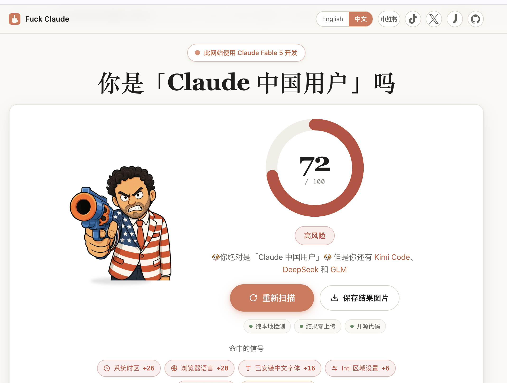
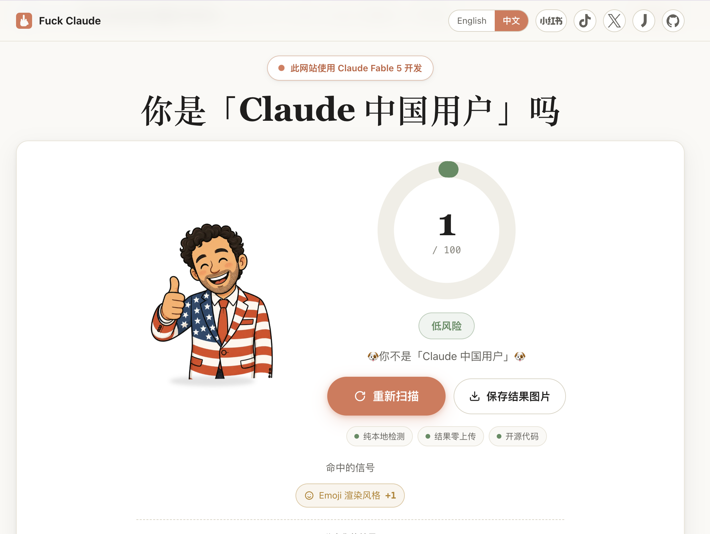
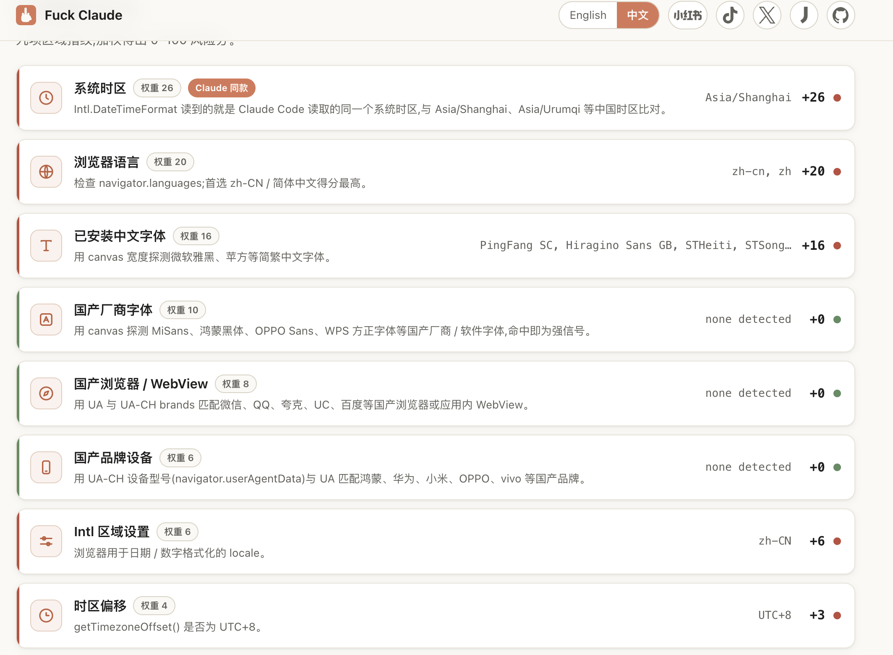
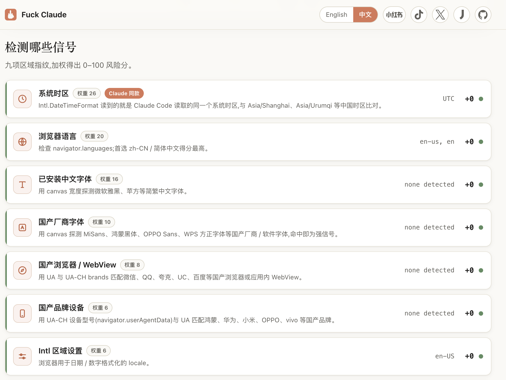

# GeoMirror

> Make Chrome's regional profile match your visible IP: geolocation, timezone, language, `Accept-Language`, and regional font signals.

GeoMirror is a Chrome Manifest V3 extension for people who use proxies, VPNs, remote desktops, or regional network exits and want the browser-visible environment to be internally consistent.

[中文说明](./README.zh-CN.md) · [Privacy policy](./PRIVACY.md) · [Technical notes](./docs/TECHNICAL.md)

> [!IMPORTANT]
> GeoMirror currently changes **browser-side signals exposed to ordinary pages in Chrome**. It does not change macOS / Windows settings, the Claude Code process, terminal traffic, `ANTHROPIC_BASE_URL`, DNS, TLS, or your proxy route. Claude Code / CLI network-environment support is still on the roadmap.

---

## Motivation: IP alone is not enough

Recent Claude / Anthropic account-ban controversies made one thing very clear: location-based risk controls can become brutal when they are applied mechanically. Many users reported that simply changing IPs, traveling, using VPNs, or having inconsistent regional signals could trigger account restrictions or bans. When a company such as Anthropic turns coarse address/location heuristics into account loss, the result is infuriating — but anger does not solve the operational problem.

The practical problem is this:

Most people only change their **IP address**. Their browser still exposes signals from somewhere else:

- `navigator.geolocation` may reveal the real physical location.
- `Date.prototype.getTimezoneOffset()` may reveal the local machine timezone.
- `Intl.DateTimeFormat().resolvedOptions().timeZone` may reveal the system timezone.
- `navigator.language` / `navigator.languages` may reveal the host language.
- the HTTP `Accept-Language` header may reveal another locale.

That mismatch is exactly the kind of thing automated risk systems can use as a proxy/VPN/fraud signal. GeoMirror exists to close that gap.

## Measured browser-side result: 72 → 1

Test project:

- Live check: [fuck-claude.vercel.app](https://fuck-claude.vercel.app/)
- Source: [LinXiaoTao/FuckClaude](https://github.com/LinXiaoTao/FuckClaude)

| Without GeoMirror | With GeoMirror |
| --- | --- |
|  |  |
|  |  |

In this test environment, the estimate fell from **72/100** to **1/100**. The system-timezone, browser-language, Chinese-font, Intl-locale, and UTC+8-offset signals stopped matching; only the weak Apple Emoji signal inferred from the user agent remained.

This is one result for a specific machine, Chrome version, exit IP, and detector version—not a guarantee about Claude or any platform's risk controls. The test project also states that only the OS-timezone signal directly corresponds to the public Claude Code reverse-engineering report; the other signals are correlation-based estimates.

## What GeoMirror does

GeoMirror detects your visible **exit IP**, derives a plausible browser profile from that IP, and applies it locally inside Chrome:

| Surface | What GeoMirror changes |
| --- | --- |
| HTML5 geolocation | Spoofs `navigator.geolocation` to a residential-looking coordinate near the exit IP. |
| Geolocation permission | Reports geolocation permission as `granted` to avoid permission-state mismatch. |
| Timezone offset | Spoofs `Date.prototype.getTimezoneOffset()` with DST-aware IANA timezone logic. |
| Intl timezone | Spoofs default `Intl.DateTimeFormat` timezone and `resolvedOptions().timeZone`. |
| Browser language | Spoofs `navigator.language` and `navigator.languages`. |
| Intl locale | Spoofs default locale for `Intl.DateTimeFormat`, `Intl.NumberFormat`, and `Intl.Collator`. |
| Request language | Sets outgoing `Accept-Language` via Chrome `declarativeNetRequest`. |
| Regional fonts | Masks common Chinese system/vendor font probes when the exit profile is non-Chinese. |

The goal is simple: if your IP looks like Tokyo, the browser should not still look like Shanghai, Los Angeles, or Berlin.

## Privacy model

GeoMirror is local-first and auditable:

- No account.
- No telemetry.
- No analytics.
- No page-content reading.
- No remote configuration.
- Computed overrides and settings are stored in `chrome.storage.local`.

### Network boundary: no project backend, but not zero-network

To match your current exit IP automatically, GeoMirror must call explicitly listed public IP/geolocation/map APIs through Chrome’s network stack. These requests are limited to:

- detecting the exit IP location,
- finding nearby residential roads,
- reverse-geocoding a display address for the popup.

It does not send page text, browsing history, cookies, credentials, form data, or scan results to the GeoMirror author. The project has no backend, account system, telemetry, or remote configuration. See [PRIVACY.md](./PRIVACY.md) and [docs/TECHNICAL.md](./docs/TECHNICAL.md) for the complete outbound-domain and field list.

“Zero network access” and “automatically follow the current public exit IP” cannot both be true: without consulting an IP information source, the extension cannot know which public exit websites see. GeoMirror keeps automatic matching and limits network access to auditable public providers.

## Comparison with adjacent tools

| Approach | Strengths | Costs / risks | Best fit |
| --- | --- | --- | --- |
| GeoMirror | Uses your existing Chrome; automatically updates location, timezone, language, and font policy from the current exit IP; open-source and lightweight | Covers a focused set of Chrome page-level regional signals, not the complete fingerprint surface | One everyday browser, VPN/proxy switching, reducing obvious regional contradictions |
| Anti-detect browsers (Multilogin, GoLogin, AdsPower, etc.) | Isolated profiles/cookies, proxy binding, broader control over Canvas, WebGL, WebRTC, hardware parameters, and automation | Separate browser/core and profile management, often paid; unusual cores, extensions, automation behavior, or internally inconsistent settings also become part of the observable surface | Multi-account isolation, teams, automation, and full profile management |
| Single-purpose timezone/language extensions | Small and simple | Usually manual; easy to forget after changing exits, and does not coordinate geolocation, fonts, locale, and request headers | Fixed regions and one-signal changes |
| OS settings / launch flags | Can affect Chrome and some local programs | Global side effects and higher switching cost; language, fonts, location, and the network exit still need separate handling | Fixed work environments or local CLI coverage |

Mature anti-detect browsers also match timezone/geolocation to a proxy IP and cover many more surfaces; see the official [Multilogin fingerprint settings](https://multilogin.com/help/en_US/profile-settings-fingerprint-section) and [GoLogin profile parameters](https://gologin.com/docs/profile-parameters). GeoMirror's distinction is not broader coverage. It avoids creating a separate browser identity and instead repairs the most obvious regional contradictions inside your existing Chrome.

“An anti-detect browser is itself a fingerprint” needs nuance: using one does not make detection inevitable, but any rare browser core, unusual API behavior, unstable parameters, or internal mismatch can increase distinguishability. A stable, coherent profile matters more than changing the maximum number of values.

## How it works

```
   proxy / VPN / remote exit          Chrome + GeoMirror
              │                              │
              ▼                              ▼
        visible exit IP ───────► background service worker
                                      │
                 ┌────────────────────┼────────────────────┐
                 ▼                    ▼                    ▼
          IP geolocation      residential roads      reverse geocode
          + timezone          near exit IP            for popup display
                 │                    │                    │
                 └──────────────► computed override ◄──────┘
                                      │
                         stored in chrome.storage.local
                                      │
                    ┌─────────────────┴─────────────────┐
                    ▼                                   ▼
          isolated-world bridge              MAIN-world injector
          reads extension storage            patches page-visible APIs
                    │                                   │
                    └────────────► page sees a coherent browser profile
```

Technical sequence:

1. `background.js` detects the visible exit IP using multiple providers.
2. `lib/providers.js` normalizes IP geolocation data and preserves provider timezone fields such as `Asia/Tokyo`.
3. `lib/geo.js` chooses a nearby residential-looking coordinate using OpenStreetMap / Overpass.
4. `lib/locale.js` infers a plausible locale bundle from country code + timezone.
5. `background.js` stores the override locally and installs a dynamic `Accept-Language` header rule.
6. `content-bridge.js` runs in Chrome’s isolated extension world, reads local storage, and publishes the payload into a DOM attribute.
7. `content-inject.js` runs in the page’s MAIN world at `document_start` and patches the browser APIs before page scripts run.

## Install

### Option A — load unpacked

1. Download or clone this repository.
2. Open `chrome://extensions`.
3. Enable **Developer mode**.
4. Click **Load unpacked**.
5. Select the `geomirror` folder.
6. Pin GeoMirror and click **Refresh** in the popup.

### Option B — Chrome Web Store

A store listing is planned. Until then, use the unpacked extension.

## Verify it works

Open a fingerprint/location test page and check these values:

```js
navigator.language
navigator.languages
Intl.DateTimeFormat().resolvedOptions()
new Date().getTimezoneOffset()
navigator.geolocation.getCurrentPosition(console.log, console.error)
```

Also check DevTools → Network → request headers and confirm `Accept-Language` matches the spoofed locale.

Useful public checks:

- [Fuck Claude live check](https://fuck-claude.vercel.app/) ([source](https://github.com/LinXiaoTao/FuckClaude))
- https://browserleaks.com/geo
- https://browserleaks.com/javascript
- https://browserleaks.com/headers

## Settings

- **Location spoof** — enable/disable geolocation override.
- **Timezone spoof** — enable/disable `Date` and `Intl.DateTimeFormat` timezone override.
- **Language spoof** — enable/disable `navigator.language(s)`, Intl locale, and `Accept-Language` header override.
- **Regional font mask** — mask common Chinese system/vendor font probes for non-Chinese exit profiles.
- **Reported accuracy (m)** — reported GPS accuracy, default 30 m.
- **Auto-refresh interval (minutes)** — how often GeoMirror re-detects the exit IP.
- **ipinfo.io token (optional)** — improves fallback reliability if you have a token.

## Why each permission

| Permission | Why |
| --- | --- |
| `storage` | Save settings and computed overrides locally. |
| `alarms` | Schedule periodic exit-IP refresh. |
| `declarativeNetRequest` | Set the outgoing `Accept-Language` header without reading page traffic. |
| `<all_urls>` content script | Patch browser APIs on normal web pages before page scripts run. |
| `host_permissions` | Call the explicitly listed IP/geolocation/Overpass/reverse-geocode providers. |

## If you do not want to install this extension

You can give the following prompt to your coding agent to audit or build a local version. It includes the provider-timezone, first-read race, and font-probe details that are easy to miss:

```text
Build an auditable Chrome Manifest V3 extension that aligns region signals visible to ordinary web pages with the current public exit IP.

Requirements:
1. State the scope precisely: ordinary Chrome pages only. Do not claim to modify the OS, Claude Code, terminal networking, DNS, TLS, proxies, or server-side risk controls.
2. Detect the current public exit IP through Chrome's network stack with multiple IP-geolocation fallbacks. Prefer a result with a valid IANA timezone; if the first provider only has coordinates, continue instead of treating timezone:null as complete.
3. Preserve country code, city/region/country, coordinates, ISP, and IANA timezone. Infer navigator.language, navigator.languages, default Intl locale, and Accept-Language from country + timezone.
4. Prefer a nearby OpenStreetMap Overpass highway=residential point over the raw IP centroid, with a boundary-safe jitter fallback.
5. Use two content scripts:
   - an isolated-world bridge that can read chrome.storage and publish a JSON payload to the DOM;
   - a MAIN-world injector at document_start that patches page-visible APIs.
6. MAIN world cannot synchronously read chrome.storage. Install a neutral first-read guard while waiting for the bridge so inline scripts cannot read the host's Asia/Shanghai / UTC+8 first; replace it immediately when the exit profile arrives.
7. Patch:
   - navigator.geolocation.getCurrentPosition / watchPosition / clearWatch
   - navigator.permissions.query for geolocation
   - Date.prototype.getTimezoneOffset with DST-aware IANA timezone logic using the receiver Date instance
   - Intl.DateTimeFormat default timezone and resolvedOptions().timeZone
   - navigator.language and navigator.languages
   - Intl.DateTimeFormat / Intl.NumberFormat / Intl.Collator default locale
   - common Chinese system/vendor font probes through CanvasRenderingContext2D, OffscreenCanvas, FontFaceSet.check, and JS-assigned inline CSS; enable only for non-Chinese exit profiles
8. Set outgoing Accept-Language through chrome.declarativeNetRequest and expose independent location/timezone/language/font toggles.
9. Store settings and overrides only in chrome.storage.local. Never read page text, cookies, credentials, forms, or browsing history. Add no accounts, telemetry, analytics, remote config, or project backend.
10. Do not claim zero network access. List every host_permission, public provider purpose, sent field, and fallback order.
11. Test DST, Invalid Date, locale inference, provider timezone enrichment, timezone:null regression, font lists/rewriting, injection order, and synchronous first-read behavior.
12. Document uncovered surfaces separately: Web Workers, special iframes, Chrome privileged pages, and Claude Code / CLI.
```

## Limitations

- GeoMirror improves consistency. It is not a complete anti-fingerprinting system.
- IP geolocation is approximate.
- Locale inference is heuristic because IP providers do not know the real user language.
- Chrome extensions cannot inject into `chrome://`, the Chrome Web Store, or other privileged pages.
- The current implementation cannot change the system timezone or network environment seen by Claude Code or other native processes. CLI support remains on the roadmap.
- Web Workers, SharedWorkers, Service Workers, and special `about:blank` / `srcdoc` frames may still expose the host environment.
- Some platforms may use additional risk signals outside browser JavaScript and headers.

## Development

Project layout:

```
geomirror/
├── manifest.json
├── background.js
├── content-bridge.js
├── content-inject.js
├── docs/
│   └── TECHNICAL.md
├── lib/
│   ├── geo.js
│   ├── font-mask.js
│   ├── locale.js
│   ├── providers.js
│   └── timezone.js
├── popup.html
├── popup.css
├── popup.js
├── test/
│   ├── inject-smoke.js
│   └── run-tests.js
└── icons/
```

Checks:

```bash
node test/run-tests.js
node test/inject-smoke.js
node --check background.js
node --check content-inject.js
node --check content-bridge.js
node --check lib/providers.js
node --check lib/locale.js
node --check lib/timezone.js
node --check lib/font-mask.js
node --check popup.js
```

After changing files, reload the extension in `chrome://extensions`.

## Contributing

Pull requests welcome. Keep the permission surface minimal and preserve the no-telemetry, no-page-content-reading guarantees.

## License

[MIT](./LICENSE)
