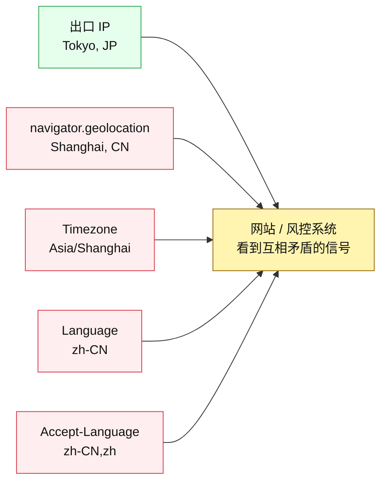
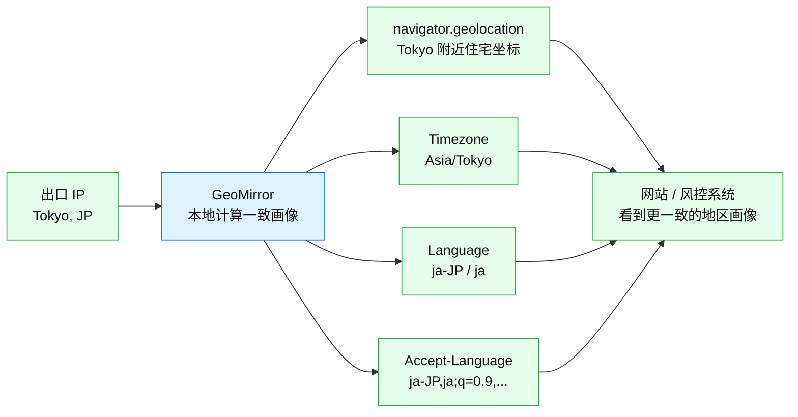
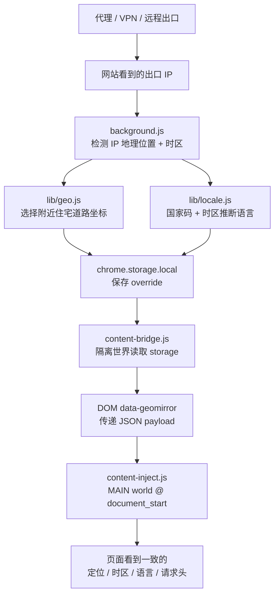

# GeoMirror

> 让 Chrome 的地区画像与当前出口 IP 保持一致：地理位置、时区、语言、`Accept-Language` 与地区字体信号。

GeoMirror 是一个 Chrome Manifest V3 扩展，适合使用代理、VPN、远程桌面、跨区出口节点的人。它解决的问题不是“换 IP”，而是“换了 IP 之后，浏览器仍然暴露出另一个地区的环境”。

[English](./README.md) · [隐私政策](./PRIVACY.md) · [技术说明](./docs/TECHNICAL.md)

> [!IMPORTANT]
> GeoMirror 当前只处理 **Chrome 普通网页能够读取的浏览器端信号**。它不会改变 macOS / Windows 系统设置，也不会改变 Claude Code 进程、终端请求、`ANTHROPIC_BASE_URL`、DNS、TLS 或代理链路。Claude Code / CLI 网络环境支持仍在开发中。

---

## Motivation：只换 IP 远远不够

最近 Claude / Anthropic 的封号风波让很多人意识到一个现实问题：平台的风控如果机械地依赖地址、地区、登录环境等信号，就可能非常粗暴。很多用户反馈过，只是换了 IP、旅行、使用 VPN、或者浏览器环境和 IP 地区不一致，就可能触发账号限制甚至封禁。

Anthropic（Claude 的母公司）把这类粗糙的位置/地址启发式信号变成账号损失风险，这种做法当然令人愤怒。但愤怒解决不了实际问题。我们能做的是把自己的浏览器环境整理得更一致，减少无谓的风险信号。

最常见的问题是：多数人只换了 **IP 地址**，但没有同步更换浏览器暴露出来的其他信息。

- `navigator.geolocation` 仍然可能暴露真实物理位置。
- `Date.prototype.getTimezoneOffset()` 仍然暴露本机时区。
- `Intl.DateTimeFormat().resolvedOptions().timeZone` 仍然暴露系统时区。
- `navigator.language` / `navigator.languages` 仍然暴露本机语言。
- HTTP `Accept-Language` 请求头仍然暴露另一个语言环境。

这些信号一旦互相矛盾，就会形成非常典型的“代理/VPN/异常环境”画像。GeoMirror 的目标就是把这条链补齐。

## 实测：浏览器端风险分从 72 降到 1

测试工具：

- 在线检测：[fuck-claude.vercel.app](https://fuck-claude.vercel.app/)
- 开源代码：[LinXiaoTao/FuckClaude](https://github.com/LinXiaoTao/FuckClaude)

| 未使用 GeoMirror | 使用 GeoMirror 后 |
| --- | --- |
|  |  |
|  |  |

本次测试环境中，风险估算从 **72/100** 降至 **1/100**：系统时区、浏览器语言、中文字体、Intl locale 和 UTC+8 offset 不再命中，仅剩由 UA 推断的 Apple Emoji 弱信号。

这是一次具体设备、Chrome 版本、代理出口和检测规则下的结果，不是对 Claude 或其他平台风控结果的保证。该检测站也明确说明：只有系统时区与公开逆向报告中的 Claude Code 机制直接对应，其余信号是相关性估算。

## 使用前后有什么变化

### 使用前：只换 IP，浏览器画像仍然分裂



### 使用后：浏览器画像跟随出口 IP



### 覆盖了哪些信号

| 信号 | 使用前常见状态 | 使用 GeoMirror 后 |
| --- | --- | --- |
| 出口 IP | 代理/VPN 节点地区 | 不改变 IP，只读取当前出口 IP |
| HTML5 定位 | 真实设备位置或系统位置 | 出口 IP 附近住宅感坐标 |
| 定位权限 | 可能显示未授权/真实状态 | 对 geolocation 查询返回 `granted` |
| Date 时区 offset | 本机时区 | 出口 IP 对应 IANA 时区，含 DST |
| Intl 时区 | 本机系统时区 | 出口 IP 对应时区 |
| navigator 语言 | 本机语言 | 根据国家码 + 时区推断 |
| Intl 默认 locale | 本机 locale | 与推断语言一致 |
| Accept-Language | 本机请求头语言 | 与推断语言一致 |
| 中文地区字体 | Canvas 可探测到苹方、微软雅黑、MiSans 等 | 非中文出口画像下屏蔽常见系统/厂商字体探测 |

## 它具体做了什么

GeoMirror 会检测当前可见的 **出口 IP**，根据这个 IP 派生出一个合理的浏览器画像，然后在 Chrome 本地应用：

1. 伪装 HTML5 地理位置：`navigator.geolocation`
2. 伪装地理位置权限：`navigator.permissions.query({ name: "geolocation" })`
3. 伪装 JS 时区 offset：`Date.prototype.getTimezoneOffset()`
4. 伪装 Intl 默认时区：`Intl.DateTimeFormat().resolvedOptions().timeZone`
5. 伪装浏览器语言：`navigator.language` / `navigator.languages`
6. 伪装 Intl 默认 locale：`Intl.DateTimeFormat` / `Intl.NumberFormat` / `Intl.Collator`
7. 伪装 HTTP 语言请求头：`Accept-Language`
8. 在非中文出口画像下遮蔽常见中文系统字体和国产厂商字体探测

目标很简单：如果你的 IP 看起来在东京，浏览器就不应该还像上海、洛杉矶或柏林。

## 隐私模型

GeoMirror 是 local-first、可审计的：

- 不需要账号。
- 没有 telemetry。
- 没有 analytics。
- 不读取网页正文内容。
- 没有远程配置。
- 设置和计算结果只保存在 `chrome.storage.local`。

### 联网边界：没有自建后端，但不是零联网

要做到一键匹配当前出口 IP，GeoMirror 必须通过 Chrome 的网络栈请求 manifest 中明确列出的公共 IP / 地图接口。这些请求只用于：

- 检测出口 IP 的位置；
- 查询出口 IP 附近住宅道路；
- 为弹窗显示做反地理编码。

它不会把网页正文、浏览历史、Cookie、账号凭据、表单内容或检测结果上传给 GeoMirror 作者；项目没有自建后端、账号系统、遥测或远程配置。完整出站域名和数据字段见 [隐私政策](./PRIVACY.md) 和 [技术说明](./docs/TECHNICAL.md)。

完全“零联网”和“根据当前公网出口 IP 自动切换”在逻辑上不能同时成立：如果不访问任何 IP 信息源，扩展就无法知道网站看到的是哪个公网出口。GeoMirror 选择保留自动匹配能力，同时把网络范围限制为可审计的公开 provider。

## 和类似方案相比

| 方案 | 优点 | 代价 / 风险 | 更适合 |
| --- | --- | --- | --- |
| GeoMirror | 继续使用原生 Chrome；根据当前出口 IP 自动更新定位、时区、语言和字体策略；开源、轻量、无需创建新浏览器画像 | 只覆盖 Chrome 网页端的一组地区一致性信号，不是完整反指纹系统 | 单一日常浏览器、VPN/代理切换、减少明显地区矛盾 |
| 指纹浏览器（Multilogin、GoLogin、AdsPower 等） | 独立 profile、Cookie 隔离、代理绑定；可控制 Canvas、WebGL、WebRTC、硬件参数等更多信号 | 需要单独浏览器/内核和 profile 管理，通常收费；独立内核、扩展集合、自动化行为或不一致配置也会成为检测面，并不天然“隐身” | 多账号隔离、团队协作、自动化和完整画像管理 |
| 单项时区 / 语言扩展 | 安装简单、权限和实现面较小 | 通常依赖手动配置；代理出口变化后容易忘记同步，且不处理定位、字体和请求头之间的一致性 | 固定地区、只需修改单一信号 |
| 修改操作系统 / 启动参数 | 可同时影响 Chrome 和部分本地程序 | 改动全局环境，切换成本高；仍需单独处理语言、字体、定位和网络出口 | 固定工作环境或需要覆盖本地 CLI |

成熟指纹浏览器也会自动让时区、定位匹配代理 IP，并覆盖更多浏览器表面；例如 [Multilogin 的官方指纹设置说明](https://multilogin.com/help/en_US/profile-settings-fingerprint-section) 和 [GoLogin 的 profile 参数文档](https://gologin.com/docs/profile-parameters)。GeoMirror 的差异不是“覆盖得更多”，而是**不创建另一套浏览器身份**：它在你现有 Chrome 中，围绕当前出口 IP 自动修正最明显的地区矛盾。

“指纹浏览器本身就是一种特征”需要更准确地理解：使用指纹浏览器不等于一定会被识别，但任何少见内核、异常 API 行为、频繁变化或参数互相矛盾都可能增加可区分性。稳定且内部一致的画像，比随机修改更多参数更重要。

## 工作原理



技术链路：

1. `background.js` 通过多个 provider 检测当前出口 IP。
2. `lib/providers.js` 统一解析 IP、国家码、经纬度、ISP、IANA 时区等字段。
3. `lib/geo.js` 使用 OpenStreetMap / Overpass 在附近选择住宅感坐标。
4. `lib/locale.js` 根据国家码 + 时区推断 locale bundle。
5. `background.js` 把 override 存入 `chrome.storage.local`，并安装动态 `Accept-Language` 规则。
6. `content-bridge.js` 在 isolated world 中读取 extension storage，把 payload 写入 DOM 属性。
7. `content-inject.js` 在 MAIN world 的 `document_start` 阶段读取 payload，并覆盖页面可见 API。

## 安装

### 方式 A：加载未打包扩展

1. 下载或克隆本仓库。
2. 打开 `chrome://extensions`。
3. 开启右上角 **开发者模式**。
4. 点击 **加载已解压的扩展程序**。
5. 选择 `geomirror` 文件夹。
6. 固定 GeoMirror，打开弹窗，点击 **Refresh**。

### 方式 B：Chrome 应用商店

计划后续上架。在此之前请使用未打包扩展。

## 验证效果

打开检测页面，检查这些值：

```js
navigator.language
navigator.languages
Intl.DateTimeFormat().resolvedOptions()
new Date().getTimezoneOffset()
navigator.geolocation.getCurrentPosition(console.log, console.error)
```

再打开 DevTools → Network → 请求头，确认 `Accept-Language` 与伪装后的语言一致。

可用检测页面：

- [Fuck Claude 在线检测](https://fuck-claude.vercel.app/)（[源码](https://github.com/LinXiaoTao/FuckClaude)）
- https://browserleaks.com/geo
- https://browserleaks.com/javascript
- https://browserleaks.com/headers

## 设置项

- **Location spoof**：启用/关闭地理位置伪装。
- **Timezone spoof**：启用/关闭 `Date` 和 `Intl.DateTimeFormat` 时区伪装。
- **Language spoof**：启用/关闭 `navigator.language(s)`、Intl locale、`Accept-Language`。
- **Regional font mask**：非中文出口画像下遮蔽常见中文系统/厂商字体探测。
- **Accuracy (m)**：上报给页面的定位精度，默认 30 米。
- **Refresh (min)**：重新检测出口 IP 的间隔。
- **ipinfo.io token（可选）**：有 token 时可提升 fallback 稳定性。

## 权限说明

| 权限 | 用途 |
| --- | --- |
| `storage` | 本地保存设置与计算出的 override。 |
| `alarms` | 定时刷新出口 IP。 |
| `declarativeNetRequest` | 设置 outgoing `Accept-Language` 请求头，不读取页面流量。 |
| `<all_urls>` 内容脚本 | 在普通网页脚本运行前 patch 浏览器 API。 |
| `host_permissions` | 请求 manifest 中列出的 IP / 地理位置 / Overpass / 反地理编码 provider。 |

## 如果你不想安装这个扩展

你可以把下面这段提示词复制给自己的编码 Agent，让它审计或构建一个本地版本。提示词已经包含当前版本最容易遗漏的时区 provider、首次读取竞态和字体探测：

```text
请构建一个可审计的 Chrome Manifest V3 扩展，让普通网页能够读取的地区画像与当前公网出口 IP 保持一致。

要求：
1. 范围必须写清楚：只处理 Chrome 普通网页端，不宣称能够修改操作系统、Claude Code、终端网络、DNS、TLS、代理或服务端风控。
2. 通过 Chrome 网络栈检测当前公网出口 IP，使用多个 IP geolocation provider fallback。优先返回包含有效 IANA timezone 的结果；第一个 provider 只有经纬度时必须继续查询，不能把 timezone:null 当成成功终点。
3. 保留国家码、城市/地区/国家、经纬度、ISP、IANA timezone。根据国家码 + timezone 推断 locale bundle：navigator.language、navigator.languages、Intl 默认 locale 和 Accept-Language。
4. 不直接使用 IP 中心点；优先用 OpenStreetMap Overpass 查询附近 highway=residential 道路，失败时使用边界安全的 jitter fallback。
5. 使用两个 content script：
   - isolated-world bridge：读取 chrome.storage，把 JSON payload 发布到 DOM；
   - MAIN-world injector：document_start 执行，patch 页面可见 API。
6. MAIN world 无法同步读取 chrome.storage。必须在等待 bridge 时同步安装中性的首次读取保护，避免页面先读到宿主的 Asia/Shanghai / UTC+8；真实出口配置到达后立即替换。
7. patch：
   - navigator.geolocation.getCurrentPosition / watchPosition / clearWatch
   - navigator.permissions.query 的 geolocation 结果
   - Date.prototype.getTimezoneOffset，使用调用者 Date 实例并支持 DST-aware IANA timezone
   - Intl.DateTimeFormat 默认 timezone 和 resolvedOptions().timeZone
   - navigator.language 和 navigator.languages
   - Intl.DateTimeFormat / Intl.NumberFormat / Intl.Collator 默认 locale
   - CanvasRenderingContext2D、OffscreenCanvas、FontFaceSet.check 和 JS 内联 CSS 中的常见中文系统/厂商字体探测；仅在非中文出口画像下启用
8. 使用 chrome.declarativeNetRequest 设置 outgoing Accept-Language，并提供 location/timezone/language/font 独立开关。
9. 所有设置和 override 只存 chrome.storage.local。不读取页面正文、Cookie、凭据、表单或浏览历史；不要账号、遥测、analytics、远程配置或自建后端。
10. 不得宣称“完全不联网”。准确列出全部 host_permissions 和每个公共 provider 的用途、发送字段及 fallback 顺序。
11. 添加自动测试，覆盖 DST、Invalid Date、locale、provider timezone 补全、timezone:null 回归、字体名单/改写、manifest 注入顺序和同步首次读取。
12. README 必须区分：浏览器网页端已覆盖；Web Worker、特殊 iframe、Chrome 特权页面和 Claude Code / CLI 属于未覆盖或后续路线。
```

## 局限

- GeoMirror 提升的是信号一致性，不是完整反指纹系统。
- IP 地理位置本身是近似值。
- 语言推断是启发式的，因为 IP provider 不知道用户真实语言。
- Chrome 扩展无法注入 `chrome://`、Chrome 商店等特权页面。
- 当前实现不能改变 Claude Code 或其他本地进程读取的系统时区和网络环境；CLI 支持正在规划中。
- Web Worker、SharedWorker、Service Worker 和特殊 `about:blank` / `srcdoc` frame 仍可能暴露宿主环境。
- 平台可能使用浏览器 JS 和请求头以外的其他风控信号。

## 开发

项目结构：

```text
geomirror/
├── manifest.json
├── background.js
├── content-bridge.js
├── content-inject.js
├── docs/
│   └── TECHNICAL.md
├── lib/
│   ├── geo.js
│   ├── font-mask.js
│   ├── locale.js
│   ├── providers.js
│   └── timezone.js
├── popup.html
├── popup.css
├── popup.js
├── test/
│   ├── inject-smoke.js
│   └── run-tests.js
└── icons/
```

检查命令：

```bash
node test/run-tests.js
node test/inject-smoke.js
node --check background.js
node --check content-inject.js
node --check content-bridge.js
node --check lib/providers.js
node --check lib/locale.js
node --check lib/timezone.js
node --check lib/font-mask.js
node --check popup.js
```

改动后，在 `chrome://extensions` 点击扩展卡片上的刷新图标重新加载。

## 许可证

[MIT](./LICENSE)
